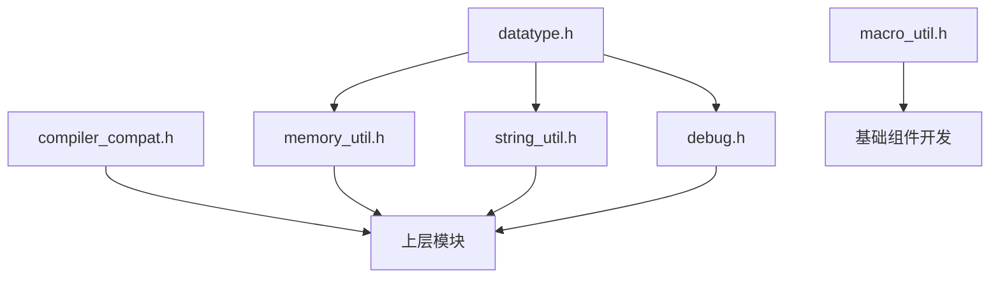

## 为什么要有 em_base？

em_base 是 libca 嵌入式库的**基础设施层**，为上层模块提供统一的类型定义、编译器抽象和基础工具函数。它的核心价值在于：

1. **跨平台可移植性**：通过编译器兼容层屏蔽 GCC、Clang、ARM Compiler、MSVC 等编译器的差异
2. **类型安全**：提供统一的固定宽度类型别名，避免各平台 `int`、`long` 等大小不一致的问题
3. **零依赖**：不依赖任何外部库，可在裸机环境直接使用
4. **可裁剪**：各子模块独立，可按需引入

---

## 模块架构

```
┌─────────────────────────────────────────────────────────────┐
│                        em_base                               │
├──────────────┬──────────────┬──────────────┬───────────────┤
│  datatype.h  │ compiler_    │  macro_      │   debug.h     │
│  类型定义     │ compat.h     │  util.h      │   调试支持    │
│              │ 编译器兼容层  │  宏工具       │               │
├──────────────┴──────────────┴──────────────┴───────────────┤
│              memory_util.h    │    string_util.h            │
│              内存操作工具      │    字符串操作工具           │
└───────────────────────────────┴─────────────────────────────┘
```

---

## 模块详细说明

### 1. datatype.h — 基础类型定义

**职责**：定义统一的固定宽度类型别名，提供类型判断工具。

**设计要点**：
- 使用 C99 标准头文件 `<stdint.h>` 的精确宽度类型
- 64 位类型 (`u64`/`i64`) 根据编译器能力自动启用
- 所有类型别名遵循 Rust 风格命名：小写 + 数字后缀

**类型体系**：

| 类型 | 说明 | 对应标准类型 |
|------|------|--------------|
| `u8`, `i8` | 8位无符号/有符号整数 | `uint8_t`, `int8_t` |
| `u16`, `i16` | 16位整数 | `uint16_t`, `int16_t` |
| `u32`, `i32` | 32位整数 | `uint32_t`, `int32_t` |
| `u64`, `i64` | 64位整数（可选） | `uint64_t`, `int64_t` |
| `f32`, `f64` | 浮点数 | `float`, `double` |
| `usize` | 大小/长度类型 | `size_t` |

**工具宏**：

```c
array_size(arr)        // 获取数组元素个数
is_unsigned_v(a)       // 判断变量是否为无符号类型
is_unsigned_t(type)    // 判断类型是否为无符号类型
unused_param(param)    // 标记未使用的参数（消除编译警告）
```

**64位支持探测**：
```c
// 自动探测逻辑：
// 1. 原生64位环境 (UINTPTR_MAX > 0xFFFFFFFF)
// 2. 编译器支持64位类型 (UINT64_MAX 定义)
// 结果：定义 HAS_INT64 宏
```

---

### 2. compiler_compat.h — 编译器兼容层

**职责**：屏蔽不同编译器的语法差异，提供统一的属性标注宏。

**支持的编译器**：GCC、Clang、ARM Compiler 5/6、MSVC、IAR

**宏定义一览**：

| 宏 | 用途 | 典型场景 |
|----|------|----------|
| `CA_INLINE` | 强制内联 | 高频小函数、性能关键路径 |
| `CA_WEAK` | 弱符号定义 | 默认实现可被用户覆盖 |
| `CA_SECTION(name)` | 链接段放置 | `.noinit`、`.ram_code` |
| `CA_ALIGNED(n)` | 对齐要求 | DMA缓冲区、硬件寄存器 |
| `CA_PACKED` | 结构体紧凑打包 | 通信协议帧解析 |
| `CA_USED` | 防止链接器优化 | 配合段自动注册机制 |
| `CA_NO_RETURN` | 无返回值函数 | 死循环、断言失败、复位 |
| `CA_LIKELY(x)` | 分支预测优化 | 错误处理路径优化 |
| `CA_UNLIKELY(x)` | 分支预测优化 | 正常执行路径优化 |

**示例：跨编译器的结构体打包**

```c
// 通信协议帧定义
#if defined(_MSC_VER)
#pragma pack(push, 1)
#endif

typedef struct {
    u8  header;
    u16 length;
    u8  data[];
} CA_PACKED frame_t;

#if defined(_MSC_VER)
#pragma pack(pop)
#endif
```

---

### 3. macro_util.h — 宏工具集

**职责**：提供预处理器元编程能力，用于基础组件开发。

**注意**：此模块主要用于库内部的基础组件开发，应用层代码建议避免使用。

**核心能力**：

```c
// 字符串化
CA_MAKE_STRING(expr)           // => "expr"

// 唯一标识符
CA_UNIQUE_ID                   // => __LINE__（行级唯一）
CA_REAL_UNIQUE_ID              // => __COUNTER__（全局唯一，若编译器支持）

// 标识符连接（支持2-9个参数）
CA_CONNECT(foo, bar)           // => foobar
CA_CONNECT(mod, _, func)       // => mod_func

// 可变参数计数
CA_VA_NUM_ARGS(a, b, c)        // => 3

// 安全局部标识符（避免命名冲突）
CA_SAFE_NAME(tmp)              // => __tmp123（带行号）
```

**典型应用场景**：

```c
// 自动生成函数名
#define DECLARE_HANDLER(name) \
    void CA_CONNECT(handler_, name)(void)

DECLARE_HANDLER(uart);  // => void handler_uart(void);
DECLARE_HANDLER(spi);   // => void handler_spi(void);
```

---

### 4. memory_util.h — 内存操作工具

**职责**：提供安全、语义清晰的内存操作函数。

**实现版本切换**：

通过 `USE_CUSTOM_MEMORY_UTIL_IMPL` 宏控制实现版本：

| 宏值 | 说明 | 适用场景 |
|------|------|----------|
| 0（默认） | 使用标准库内联实现 | 推荐，性能更优，编译器可深度优化 |
| 1 | 使用自定义实现 | 无标准库环境的嵌入式场景 |

在 `libca.em` 源码包接入中，可通过 `em.add_libs(target, "em_base", opts)` 的
`opts.memory_util` 控制该宏：

| `opts.memory_util` | 宏效果 |
|--------------------|--------|
| `std`（默认） | `USE_CUSTOM_MEMORY_UTIL_IMPL=0` |
| `custom` | `USE_CUSTOM_MEMORY_UTIL_IMPL=1` |

**API 设计原则**：
- 命名风格：`mem_xxx`，与标准库 `memxxx` 区分
- 参数顺序：目标地址在前，源地址在后（与标准库一致）
- 安全性：`mem_cpy` 使用 `restrict` 提示不重叠，重叠场景使用 `mem_move`
- NULL 安全：所有函数都对 NULL 参数进行检查，避免未定义行为

**函数列表**：

| 函数 | 说明 | 返回值 |
|------|------|--------|
| `mem_set(dest, val, size)` | 按字节填充 | 目标指针 |
| `mem_zero(dest, size)` | 清零 | void |
| `mem_cpy(dest, src, size)` | 内存拷贝（不处理重叠） | 目标指针 |
| `mem_move(dest, src, size)` | 内存移动（安全处理重叠） | 目标指针 |
| `mem_cmp(s1, s2, size)` | 内存比较 | 0相等，非0为差值 |
| `mem_find_byte(buf, val, size)` | 字节查找 | 找到的地址或NULL |
| `mem_is_all_val(buf, val, size)` | 检查是否全为某值 | bool |
| `mem_swap(s1, s2, size)` | 内存交换 | void |

**与标准库的区别**：
- 明确的语义：`mem_cpy` 明确声明不处理重叠，强制开发者考虑数据安全
- NULL 安全：标准库函数对 NULL 参数是未定义行为，本模块提供安全的 NULL 处理
- 扩展功能：`mem_find_byte`、`mem_is_all_val`、`mem_swap` 是常用但标准库未提供的功能

---

### 5. string_util.h — 字符串操作工具

**职责**：提供安全、易用的字符串操作函数。

**实现版本切换**：

通过 `USE_CUSTOM_STRING_UTIL_IMPL` 宏控制实现版本：

| 宏值 | 说明 | 适用场景 |
|------|------|----------|
| 0（默认） | 使用标准库内联实现 | 推荐，性能更优 |
| 1 | 使用自定义实现 | 无标准库环境的嵌入式场景 |

在 `libca.em` 源码包接入中，可通过 `em.add_libs(target, "em_base", opts)` 的
`opts.string_util` 控制该宏：

| `opts.string_util` | 宏效果 |
|--------------------|--------|
| `std`（默认） | `USE_CUSTOM_STRING_UTIL_IMPL=0` |
| `custom` | `USE_CUSTOM_STRING_UTIL_IMPL=1` |

**注意**：仅部分函数支持标准库内联实现，以下函数因语义差异始终使用自定义实现：
- `str_cpy`, `str_cat`：返回值语义不同（返回长度而非指针）
- `str_trim`, `str_ltrim`, `str_rtrim`：标准库无对应函数
- `str_to_upper`, `str_to_lower`, `str_reverse`：标准库无对应函数
- `str_starts_with`, `str_ends_with` 系列：标准库无对应函数

**设计要点**：
- 所有涉及缓冲区的函数都需要显式传入缓冲区大小
- 返回值语义：成功返回实际长度，失败返回负数错误码

**错误码定义**：

| 错误码 | 值 | 说明 |
|--------|-----|------|
| `STR_OK` | 0 | 成功 |
| `STR_ERR_NULL` | -1 | 空指针错误 |
| `STR_ERR_SIZE` | -2 | 缓冲区大小不足 |
| `STR_ERR_INVALID` | -3 | 非法大小 |

**函数分类**：

**字符操作**：
```c
char_to_lower(c)    // 字符转小写
char_to_upper(c)    // 字符转大写
```

**长度获取**：
```c
str_len(str)                    // 不带限制
str_nlen(str, max_len)          // 带最大长度限制（更安全）
```

**复制与拼接**：
```c
str_cpy(dest, src, size)        // 返回实际复制长度或错误码
str_cat(dest, src, dest_max)    // 返回拼接后长度或错误码
```

**比较与查找**：
```c
str_cmp(s1, s2, size)           // 比较指定长度
str_is_equal(s1, s2)            // 判断完全相等
str_find_ch(str, c)             // 查找字符
str_find_str(haystack, needle)  // 查找子串
```

**字符串处理**：
```c
str_trim(str)                   // 原地去除首尾空白
str_to_upper(str)               // 原地转大写
str_to_lower(str)               // 原地转小写
str_reverse(str)                // 原地翻转
```

**前缀后缀判断**：
```c
str_starts_with(str, prefix)    // 前缀判断
str_starts_with_i(str, prefix)  // 前缀判断（忽略大小写）
str_ends_with(str, suffix)      // 后缀判断
str_ends_with_i(str, suffix)    // 后缀判断（忽略大小写）
```

---

### 6. debug.h — 调试支持模块

**职责**：为 libca 内部提供调试输出能力，独立于用户日志系统。

**架构设计**：
```
┌─────────────┐
│  应用层      │  → 使用 em_log 模块
├─────────────┤
│  libca内部   │  → 使用 debug 模块
├─────────────┤
│  硬件回调    │  → debug_init 注册
└─────────────┘
```

**初始化与输出**：

```c
// 初始化：注册硬件输出回调
void debug_init(void (*hw_puts_output)(const char* str));

// 基础输出
void debug_puts(const char* str);           // 直接输出字符串
void debug_printf(const char* fmt, ...);    // 格式化输出
```

**调试宏**：

| 宏 | 说明 | 编译开关 |
|----|------|----------|
| `debug_print(fmt, ...)` | 带文件名行号的调试输出 | `CA_USE_DEBUG_MODE` |
| `debug_assert(expr)` | 调试断言（失败时死循环） | `CA_USE_DEBUG_ASSERT` |
| `param_check(expr)` | 参数检查（失败时打印警告） | `CA_USE_PARAM_CHECK` |

**配置方式**：

```c
// 方式1：直接定义宏（编译选项）
#define CA_USE_DEBUG_MODE 1
#define CA_USE_DEBUG_ASSERT 1
#define CA_USE_PARAM_CHECK 1

// 方式2：使用自定义配置文件
#define CA_USE_CUSTOM_DEBUG_CONFIG "my_debug_config.h"
```

**可配置项**：

| 宏 | 默认值 | 说明 |
|----|--------|------|
| `CA_USE_DEBUG_MODE` | 1 | 启用调试输出 |
| `CA_USE_DEBUG_ASSERT` | 1 | 启用调试断言 |
| `CA_USE_PARAM_CHECK` | 1 | 启用参数检查 |
| `CA_PRINT_BUFFER_SIZE` | 256 | 格式化缓冲区大小 |
| `CA_PRINT_NEWLINE` | `"\n"` | 换行符 |

---

## 模块依赖关系



**依赖说明**：
- `datatype.h` 是最基础的模块，被其他所有模块依赖
- `compiler_compat.h` 独立存在，可被任何模块使用
- `macro_util.h` 独立存在，主要用于库内部的元编程
- `memory_util.h` 和 `string_util.h` 提供运行时工具函数
- `debug.h` 提供 libca 内部调试能力

---

## 使用指南

### 最小引入

只需类型定义和编译器兼容：
```c
#include "datatype.h"
#include "compiler_compat.h"
```

### 完整引入

```c
#include "datatype.h"
#include "compiler_compat.h"
#include "memory_util.h"
#include "string_util.h"
#include "debug.h"
```

### 调试模块初始化示例

```c
// 硬件串口输出回调
void uart_puts(const char* str) {
    HAL_UART_Transmit(&huart1, (uint8_t*)str, strlen(str), HAL_MAX_DELAY);
}

int main(void) {
    // 初始化调试模块
    debug_init(uart_puts);
    
    // 使用调试输出
    debug_print("System started, heap: %d", heap_size);
    
    // 参数检查
    param_check(ptr != NULL);
    
    // 断言
    debug_assert(config != NULL);
    
    // ...
}
```

---

## 设计原则

1. **零依赖**：不依赖任何外部库或操作系统服务
2. **最小化**：每个模块职责单一，避免功能膨胀
3. **可预测**：函数行为明确，无隐藏副作用
4. **可移植**：跨编译器、跨平台兼容
5. **可配置**：通过宏开关控制功能，支持裁剪
6. **可优化**：支持标准库内联实现，性能优先

---

## 单元测试

`memory_util` 和 `string_util` 模块提供双版本测试目标，确保两种实现版本的行为一致：

| 测试目标 | 说明 |
|----------|------|
| `test-memory_util_std` | 测试标准库内联实现版本（默认） |
| `test-memory_util_custom` | 测试自定义实现版本 |
| `test-string_util_std` | 测试标准库内联实现版本（默认） |
| `test-string_util_custom` | 测试自定义实现版本 |

运行测试：
```bash
# 运行所有测试
xmake run test-memory_util_std
xmake run test-memory_util_custom
xmake run test-string_util_std
xmake run test-string_util_custom
```

