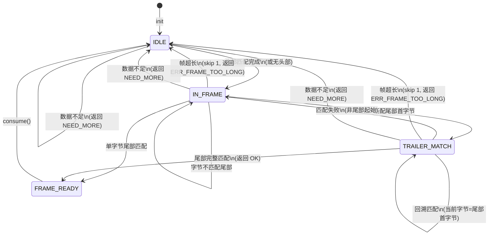
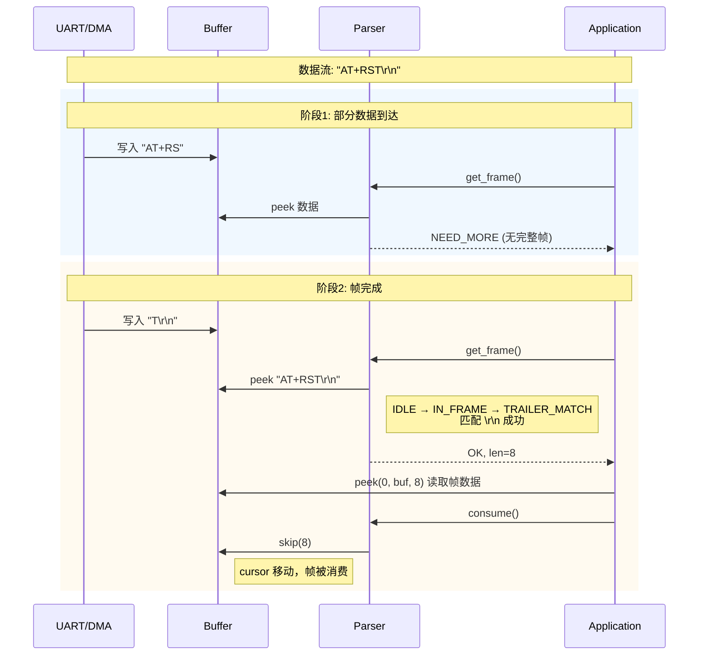
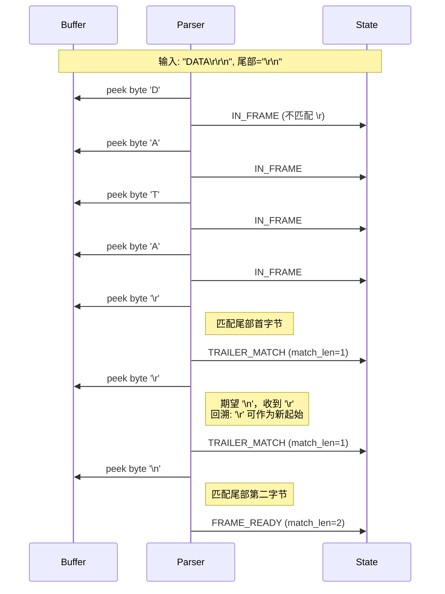
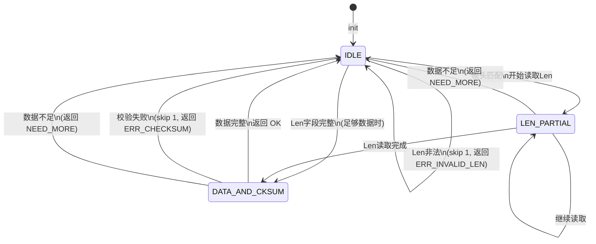
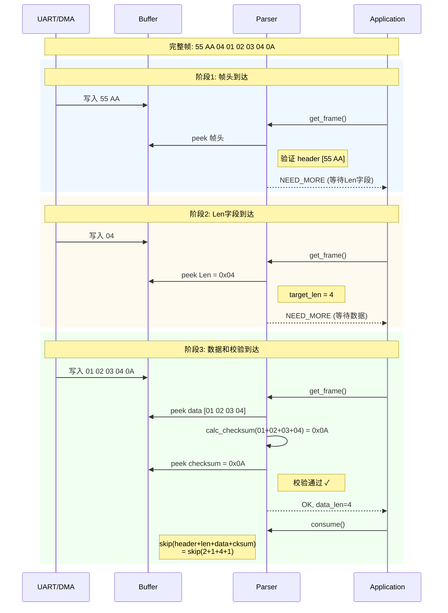
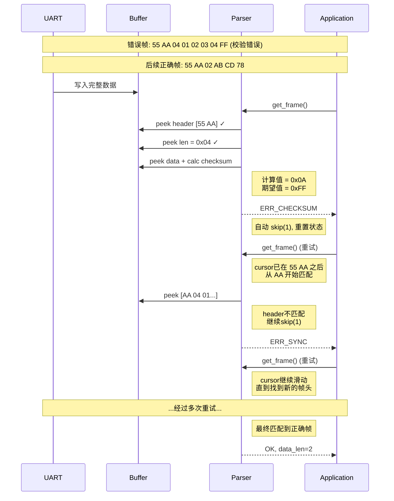

## 为什么要有em_dstream？

em_dstream的目的是实现一套统一的数据缓冲和解析中间件，对于数据缓冲，提供各种缓冲区，对于解析，提供统一的接口，并且提供一些标准化的解析器工具。

最终，在嵌入式中，数据接收和帧截断这个事情我称作为前端部分，而后端是一个数据帧内的协议解析。中间我们通过一个dstream_t对象传递，前端持有dstream_t，可能利用dstream_t的操作往里面写入数据，也可能针对不同情况下直接利用一些特殊手段直接操作底层缓冲区，比如利用一次性的DMA、循环的DMA等写入，但是上层协议解析无需关心具体底层是连续的内存还是循环的缓冲区还是分散内存组成的缓冲区。

## 数据帧解析器

### 定界符解析器

定界符解析器（`delimiter_parser`）用于处理以特定字节序列作为帧边界的数据协议，典型场景包括：
- AT 指令（`\r\n` 结尾）
- HDLC 帧（`0x7E` 头尾）
- 自定义协议（特定头部/尾部标识）

**核心设计：**
- 状态机驱动，支持流式解析（数据可分批到达）
- 零拷贝设计：解析过程仅通过 `peek` 查看数据，不移动 cursor
- 支持头部、尾部或两者同时存在的定界方式
- 自动处理尾部匹配回溯（如 `\r\r\n` 正确匹配 `\r\n`）
- 超长帧检测与自动恢复（滑动窗口机制）

#### 状态转移图



#### 解析示例：AT 指令（`\r\n` 结尾）



#### 尾部匹配回溯示例

当尾部为 `\r\n`，收到 `\r\r\n` 时的处理：



**使用限制：**
- 只有头部没有尾部时，帧无法自动结束，需配合超时机制
- 头部和尾部相同时，需在尾部后有数据才能触发帧检测

---

### 长度前置解析器

长度前置解析器（`length_parser`）用于处理 `[Header][Len][Data...][Checksum]` 格式的数据帧，典型场景包括：
- Modbus RTU
- 自定义串口协议
- 网络数据包（带长度字段）

**核心设计：**
- 支持可选帧头（如 `\x55\xAA`）
- 长度字段支持 1/2/4 字节，大小端可配置
- 校验支持：无校验、8位校验和、CRC-16、CRC-32
- 联合体函数签名，支持不同类型的增量校验计算
- 错误自动恢复：校验失败或长度非法时自动跳过 1 字节重新同步

#### 状态转移图



#### 解析示例：带帧头和校验的协议

帧格式：`[0x55 0xAA][u8 len][data...][u8 checksum]`



#### 错误恢复示例：校验失败



#### 校验函数设计

```c
typedef enum {
    LENGTH_PARSER_CKSUM_NONE = 0,   /* 无校验 */
    LENGTH_PARSER_CKSUM_U8,         /* 8位校验和 */
    LENGTH_PARSER_CKSUM_CRC16,      /* CRC-16 */
    LENGTH_PARSER_CKSUM_CRC32,      /* CRC-32 */
} length_parser_cksum_type_t;

typedef union {
    void* null_fn;
    u8 (*checksum_u8)(const u8* data, usize len, u8 prev);
    u16 (*crc16)(const void* data, usize len, u16 prev);
    u32 (*crc32)(const void* data, usize len, u32 prev);
} length_parser_cksum_func_t;
```

**配置参数：**
| 参数 | 说明 |
|------|------|
| `len_field_size` | 长度字段字节数 (1/2/4) |
| `len_big_endian` | 长度字段字节序 |
| `checksum_size` | 校验字段字节数 (0/1/2/4) |
| `checksum_big_endian` | 校验字段字节序 |
| `cksum_init_val` | 校验初始值（如 CRC-16 用 0xFFFF）|

**错误处理：**
- `ERR_SYNC`：帧头不匹配，自动跳过 1 字节
- `ERR_INVALID_LEN`：长度字段值超出 `max_frame_len`
- `ERR_CHECKSUM`：校验失败，自动跳过 1 字节


