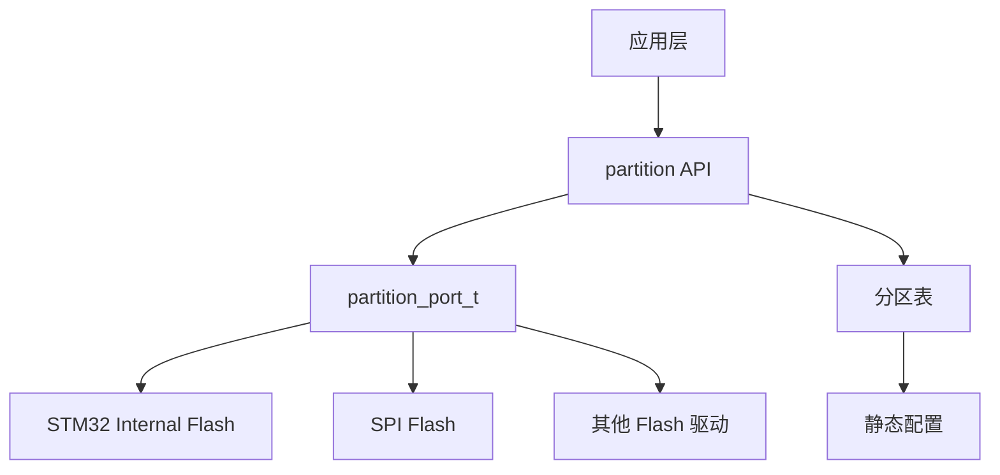
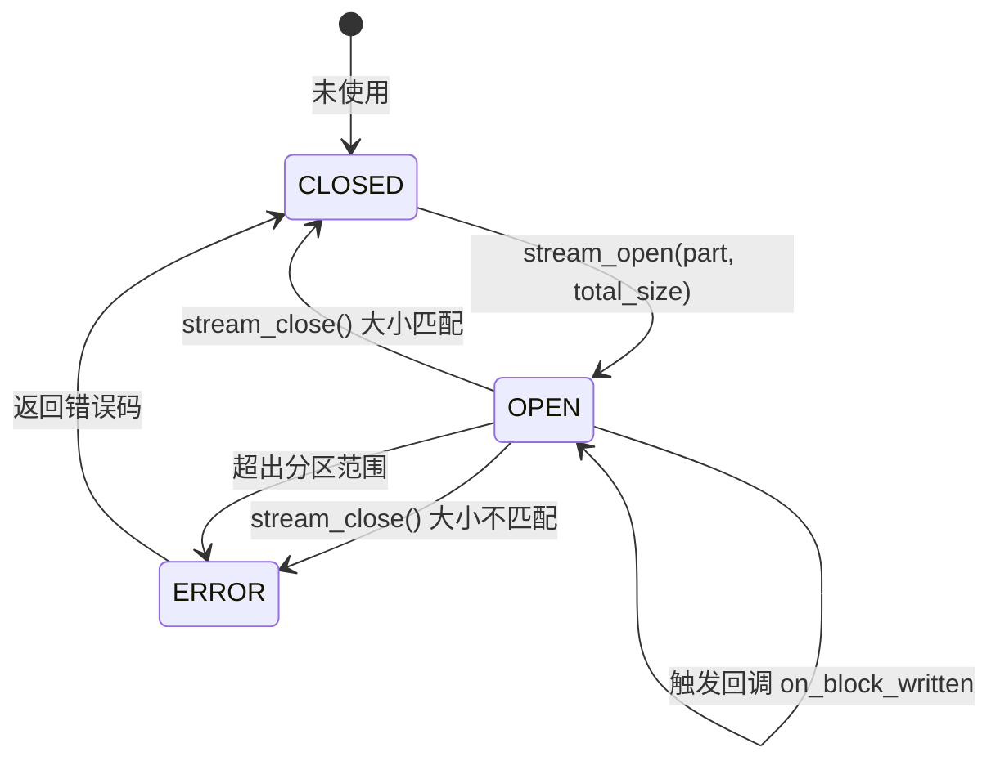
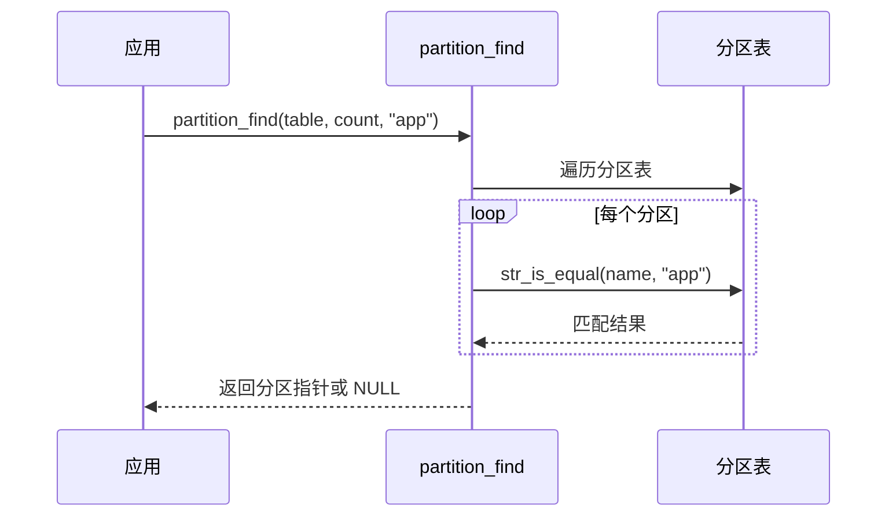
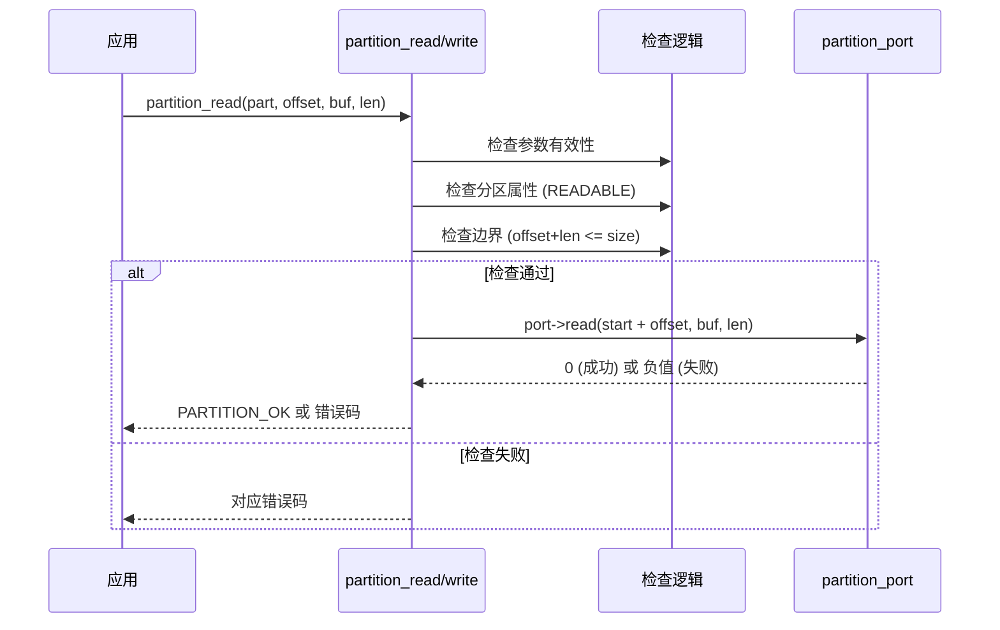
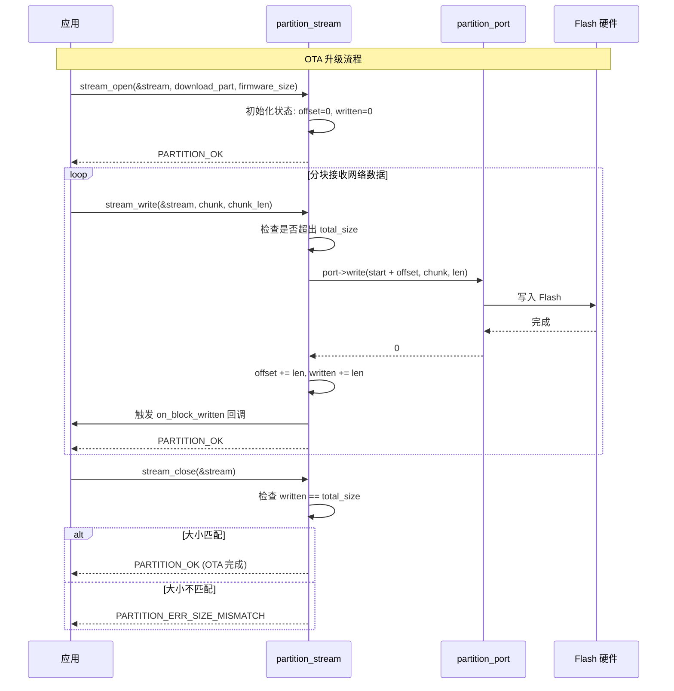

## 为什么要有 em_ota？

em_ota 模块旨在为嵌入式系统提供一套轻量级、无动态内存分配的 Flash 分区管理方案。其核心价值在于：

1. **抽象硬件差异**：通过 Port 层屏蔽不同 Flash 控制器的操作差异
2. **统一分区管理**：用静态分区表定义 Flash 布局，支持按名称查找分区
3. **OTA 友好**：提供流式写入接口，适配网络分块接收场景
4. **零动态分配**：所有结构体由用户静态分配，适合裸机和 RTOS 环境

### v1.1 定位修正

v1.0 只覆盖了「分区管理」这一层。完整的 OTA 还缺「镜像格式与完整性校验」。
v1.1 补齐这一层，但坚持一条纪律：**每一步交付一个独立可用的最小增量，拒绝一步到位**。
（该纪律来自 ota_demo 项目的复盘：功能越堆越多、文档与实现漂移、最终联调失败。）

---

## 设计目标

| 目标 | 说明 |
|------|------|
| 无动态内存 | 所有配置和状态由用户静态分配 |
| 分层解耦 | 上层分区逻辑与底层 Flash 操作分离 |
| 安全检查 | 自动校验分区属性和边界 |
| 流式支持 | 支持分块写入、进度跟踪、回调通知 |

---

## 架构设计

### 分层架构

```
┌─────────────────────────────────────────────────────────────┐
│                      应用层                                  │
│            (OTA升级、参数存储、固件管理)                      │
├─────────────────────────────────────────────────────────────┤
│                     partition API                            │
│    ┌─────────────┬─────────────┬─────────────────────────┐  │
│    │ 分区查找     │ 基础操作     │ 流式写入                │  │
│    │ find()      │ read/write  │ stream_open/write/close │  │
│    └─────────────┴─────────────┴─────────────────────────┘  │
├─────────────────────────────────────────────────────────────┤
│                    partition_port_t                          │
│              read() / write() / erase()                      │
├─────────────────────────────────────────────────────────────┤
│                   底层 Flash 驱动                             │
│              (HAL / 厂商驱动 / 模拟实现)                       │
└─────────────────────────────────────────────────────────────┘
```

### 模块关系



---

## 核心设计

### 1. 分区表（Partition Table）

分区表是用户定义的静态数组，描述整个 Flash 的逻辑布局。

**设计考量：**
- **静态定义**：编译期确定，无运行时开销
- **名称索引**：字符串名称便于代码可读性和灵活性
- **属性标志**：位域组合，支持多种属性

```c
typedef struct partition {
    const char *name;   // 分区名称
    u32 start;          // 起始地址（绝对地址）
    u32 size;           // 大小（字节）
    u8 flags;           // 属性标志
} partition_t;
```

**典型分区布局示例：**

```
Flash 地址空间 (STM32 示例)
┌─────────────────────────────────────────────────┐ 0x08000000
│ bootloader  (64KB)   [只读]                     │
├─────────────────────────────────────────────────┤ 0x08010000
│ app         (256KB)  [可读/可写/可擦除]         │
├─────────────────────────────────────────────────┤ 0x08050000
│ download    (128KB)  [可读/可写/可擦除] OTA暂存  │
├─────────────────────────────────────────────────┤ 0x08070000
│ params      (64KB)   [可读/可写/可擦除] 参数存储 │
└─────────────────────────────────────────────────┘ 0x08080000
```

### 2. Port 抽象层

Port 层是分区管理器与底层 Flash 驱动的桥梁，遵循依赖注入原则。

**设计优势：**
- 硬件无关：上层逻辑不依赖具体 Flash 类型
- 可测试性：单元测试时可注入模拟实现
- 灵活切换：同一套代码适配不同硬件平台

```c
typedef struct partition_port {
    i32 (*read)(u32 addr, u8 *buf, u32 len);
    i32 (*write)(u32 addr, const u8 *data, u32 len);
    i32 (*erase)(u32 addr, u32 len);
} partition_port_t;
```

**地址转换约定：**
- Port 函数接收的是**绝对地址**（由分区起始地址 + 偏移量计算）
- 分区管理器内部处理地址计算，Port 实现无需关心分区概念

### 3. 流式写入（Stream Write）

流式写入专为 OTA 升级设计，解决以下问题：

**问题场景：**
- 固件通过网络分块下载，不能一次性写入
- 需要跟踪写入进度
- 写入完成后需要校验完整性

**状态机设计：**



**流状态结构：**

```c
typedef struct partition_stream {
    const partition_t *part;            // 目标分区
    u32 current_offset;                 // 当前偏移
    u32 total_size;                     // 预期总大小
    u32 written;                        // 已写入字节数
    partition_stream_callback_t on_block_written;  // 回调
    void *userdata;                     // 用户数据
} partition_stream_t;
```

**回调机制设计：**

回调在每次成功写入后触发，典型用途：
- 更新 OTA 进度条
- 增量计算 CRC/校验和
- 记录写入日志

---

## 关键流程

### 分区查找流程



### 基础读写流程



### 流式写入流程（OTA 场景）



---

## 安全设计

### 边界检查

每次读写操作都会执行三重检查：

```
1. 参数检查    → NULL 指针、零长度
2. 属性检查    → 分区是否支持该操作
3. 边界检查    → offset + len ≤ size
```

### 错误恢复

| 错误类型 | 返回值 | 处理建议 |
|----------|--------|----------|
| 分区不存在 | `ERR_NOT_FOUND` | 检查分区表定义 |
| 超出范围 | `ERR_OUT_OF_RANGE` | 检查偏移和长度 |
| 只读分区 | `ERR_READONLY` | 检查分区属性标志 |
| 写入失败 | `ERR_WRITE_FAIL` | 检查 Flash 是否擦除、是否解锁 |
| 大小不匹配 | `ERR_SIZE_MISMATCH` | 检查网络传输是否完整 |

---

## 扩展点

### 1. 扇区对齐擦除

当前设计中 `partition_erase_range()` 直接传递长度给 Port。如需扇区对齐：

- 可在 Port 层实现对齐处理
- 或在上层调用前自行对齐

### 2. 磨损均衡

分区管理器不处理磨损均衡，但可通过以下方式扩展：

- Port 层实现磨损均衡映射
- 或使用专门的 FTL（Flash Translation Layer）

### 3. 写入校验

可在回调函数中实现增量校验：

```c
void verify_callback(u32 offset, const u8 *data, u32 len, void *userdata)
{
    crc_ctx_t *crc = (crc_ctx_t*)userdata;
    crc_update(crc, data, len);  // 增量计算 CRC
}
```

---

## 设计决策

| 决策 | 原因 |
|------|------|
| 静态分区表 | 无动态内存，编译期确定布局 |
| 绝对地址 | 简化 Port 实现，无需维护基地址 |
| 流式接口 | 适配 OTA 分块接收，支持进度跟踪 |
| 单例 Port | 系统通常只有一种 Flash 类型，简化接口 |
| 无锁设计 | 由用户决定是否需要线程保护 |

---

## OTA 升级流程层设计（v1.1）

### 需求定义

先回答「为什么、为谁、保什么」，再谈结构。

**目标硬件**：小资源裸机 MCU 为主力（Cortex-M0/M3 级，内部 flash 64~256KB、RAM ≤20KB、
无文件系统）。外部 SPI flash（如 w25qxx）只作为暂存区角色，不要求在其上直接执行。
中高端 + RTOS 平台自然被覆盖（资源更宽裕），但**不为它们增加任何默认开销**。

**核心需求（P0，恒在，不可关闭）**：

| 编号 | 需求 | 说明 |
|------|------|------|
| N1 | **小体积** | 最高优先级。基础路径 ROM 占用以百字节级计；零动态内存；全静态分配 |
| N2 | 可靠写入 | 镜像完整性校验：magic / size / CRC32 读回比对 |
| N3 | 硬件无关 | port 注入；host 上 mock 全链路可测，硬件只是最后一步 |

**扩展需求（P1，编译期可插拔，默认全关）**：

| 编号 | 需求 | 价值 |
|------|------|------|
| E1 | 断电安全激活标记 | 「绝不变砖」的地基：STAGED/ACTIVATED 两阶段记录 |
| E2 | 搬运器（暂存区 → app 区） | 单区+暂存拓扑的闭环 |
| E3 | boot 决策模板 | 启动判定/确认/回滚钩子，应用填回调即得安全升级 |
| E4 | A/B 双区切换 | 与单区拓扑互为替代，编译期二选一 |
| E5 | 签名校验钩子 | 只留接口位，不实现算法 |

### 配置体系：ota_cfg.h

一切可插拔通过**用户工程提供的 cfg 头文件**在编译期决定（对齐 lwIP opt.h 惯例），
未定义的宏取默认值（默认全关，只留核心）。宏前缀统一 `OTA_CFG_`，不带 EM_ 前缀——
cfg 是面向用户工程的开关面，不是模块内部符号：

```c
/* ota_cfg.h —— 用户工程提供，或使用内置默认 */
#define OTA_CFG_ENABLE_IMAGE         1  /* 镜像头+校验（核心，建议恒开） */
#define OTA_CFG_ENABLE_ACTIVATE      0  /* E1 两阶段激活标记 */
#define OTA_CFG_ENABLE_MOVER         0  /* E2 暂存→app 搬运器 */
#define OTA_CFG_ENABLE_BOOT_TEMPLATE 0  /* E3 boot 决策模板 */
#define OTA_CFG_ENABLE_DUAL_SLOT     0  /* E4 A/B 双区拓扑 */
#define OTA_CFG_ENABLE_SIGN_HOOK     0  /* E5 签名校验钩子 */
```

编译期依赖规则（用 `#error` 断言固化，防止错误组合）：

- `MOVER` ⇒ `IMAGE`（搬运前必须会校验）
- `BOOT_TEMPLATE` ⇒ `ACTIVATE` 或 `DUAL_SLOT`（模板至少要有一种拓扑可决策）
- `DUAL_SLOT` 与 `MOVER` 可共存（A/B 也可配暂存），但单区内二者互斥使用由应用保证
- 关闭的宏对应的目标文件**整体不参与链接**（按文件拆分，而非函数级 `#if`），保证体积可预期

### 分层架构

```
┌────────────────────────────────────────────────────────┐
│ 应用工程：自行组合各组件 + IAP 跳转实现                   │
│   em_shell / em_protocol / em_ota 平级独立，             │
│   em_ota 不感知、不绑定任何其他组件                       │  ← 组合权在用户
├────────────────────────────────────────────────────────┤
│ [E3] boot 决策模板（可选）                               │
│      输入：镜像有效性 + 激活状态 + 确认标志               │
│      输出：决策（跳转/进入升级/回滚），跳转动作由应用注入  │
├──────────────────────┬─────────────────────────────────┤
│ [E2] 搬运器           │ [E1] 激活标记 / [E4] slot 选择   │
│ 暂存区 → app 区       │ 断电安全的编译期二选一            │
├──────────────────────┴─────────────────────────────────┤
│ 核心（恒在）：ota_image（格式+校验） + partition（v1.0）  │
├────────────────────────────────────────────────────────┤
│ em_base（datatype/param_check） + em_util（crc32）      │
└────────────────────────────────────────────────────────┘
   移植层：partition_port_t + IAP 跳转 + 串口接收缓冲
```

依赖方向严格向下；E1~E5 相互之间不横向依赖（boot 模板只消费 activate/slot 的查询接口）。

### ota_image 镜像头格式

镜像 = 头 + 载荷。上位机把头拼在 bin 前面发送即可，MCU 侧对头无特殊处理
（当作普通流数据写入），只在 close 后校验。

```c
#define OTA_IMAGE_MAGIC 0x3054414F  /* "OTA0" 小端 */

typedef struct ota_image_header {
    u32 magic;           /* 固定魔数，识别合法镜像 */
    u32 image_size;      /* 载荷字节数（不含头） */
    u32 crc32;           /* 载荷 CRC32（crc32_ieee，不含头） */
    u16 version_major;   /* 语义化版本，仅记录用 */
    u16 version_minor;
    u32 timestamp;       /* 构建 Unix 时间戳，可为 0 */
} ota_image_header_t;    /* 20 字节，字段自然对齐，无需 pack */
```

设计考量：

- **头随流写入而非带外传递**：MCU 不需要「先拿元数据再收数据」的两阶段状态，
  stream_write 全程只管写字节，逻辑最薄。
- **CRC 只覆盖载荷**：头本身损坏时 magic/size 校验自然失败，不需要头的 CRC。
- **版本号放头里**：替代 ota_demo 从 YMODEM 文件名解析版本的做法（文件名约定脆弱、
  上位机各自实现易漂移——复盘教训 P1-2）。
- **20 字节不设 reserved**：未来扩展用 magic 版本号演进（"OTA1"），不为想象中的需求占字节。

### 完整性校验策略：读回比对

`stream_close` 只能查大小匹配，查不出写入内容损坏。`ota_image_verify()` 流程：

1. 从分区读回头部，校验 magic / image_size 与预期一致；
2. 分块读回载荷，增量累加 CRC32，与头部 crc32 比对。

读回而不是在 RAM 里顺手累计的原因：**顺带验证了 Flash 写入本身的正确性**
（擦除遗漏、位翻转都查得出来），这是 ota_demo 没做到的一环。
代价是整镜像多一遍读，对内部 flash 与 SPI flash 都可接受。

配套小改动：`em_util/crc.h` 新增增量接口
`u32 crc32_ieee_ex(const void* data, usize size, u32 previous_crc)`
（参数顺序对齐既有 `crc16_modbus_ex` 惯例：previous_crc 传上次返回值、首块传 0；
表驱动实现已存在，仅暴露累积形式。小资源 MCU 无法一次性读入整镜像，必须分块算）。

### 擦除契约（不在 v1.1 改代码，但必须写死规则）

partition_stream 有意不做擦除（v1.0 决策保持不变），调用方必须在**开始传数据之前**
完成整个目标分区的擦除。时机上有两个安全窗口：

- 收到镜像头（拿到 `image_size`）之后、ACK 数据包之前——YMODEM 协议天然在此停顿；
- 或更简单：进入接收命令后、启动协议握手前全分区预擦除。

**为什么不能边收边擦**（ota_demo 失败主因）：页擦除典型 20~40ms，115200 波特率下
每毫秒约 11.5 字节持续涌入，中断环形缓冲需覆盖整个擦除时长；缓冲不足即静默丢字节，
表现为传输中途 CRC 错误、NAK 重试到超时。把擦除挪到数据流开始前，阻塞发生在
「对端还在等 C/N」的阶段，风险归零。

### 可插拔组件设计（M2+ 预览，实现前不展开细节）

- **E1 激活标记**：记录结构 = `{seq, state, image_crc, record_crc}`，双记录交替写、
  seq 大者有效，天然防撕裂。存放位置由应用指定（参数分区或 app 分区尾块）。
- **E2 搬运器**：暂存区校验通过后，按块搬运到 app 区并逐块累计 CRC，完成后对 app 区
  再跑一次 `ota_image_verify`。失败即停在暂存态，app 区保持旧固件可启动。
- **E3 boot 模板**：纯函数决策 `ota_boot_decide(状态输入) → 决策枚举`，
  不含任何硬件操作；跳转动作以函数指针注入，模板本身 host 可单测。
- **E4 slot 选择**：`ota_slot_active()/ota_slot_inactive()` 接口 + cfg 决定返回策略，
  单区拓扑下退化为常量，调用方代码零分支。

### 资源预算（目标值，M1 落地后实测校准）

| 组件 | ROM 预算（-Os, Cortex-M3） |
|------|---------------------------|
| partition（v1.0 已有） | ~1KB |
| ota_image + verify | ~0.5KB（CRC 表与 em_util 共享） |
| activate | ~0.2KB |
| mover | ~0.3KB |
| boot 模板 | ~0.5KB |
| **核心全开基础路径** | **≤2KB** |

每个可插拔组件在 unittests 里附带体积实测记录，防止体积无感膨胀。

### 里程碑

| 里程碑 | 内容 | 验收标准 | 状态 |
|--------|------|----------|------|
| M1 | cfg 体系 + `ota_image` + `verify` + em_util 增量 CRC32 + mock 单测 | host 测试跑通（纯内存模拟，不依赖传输协议）：镜像 blob 不规则分块 → stream 写 mock flash → verify 通过且读回逐字节一致；全特性关闭时无新增代码进链接。与具体协议（ymodem 等）的对接属于集成层/演示工程，不进本模块单测（对应 issue #27 验收） | 待实现 |
| M2 | E1 激活标记 | 注入式断电测试：任意时刻掉电，重启后状态可判定且不误激活 | 设计完成 |
| M3 | E2 搬运器（默认拓扑闭环） | 暂存→搬运→二次 verify 全链路 mock 测试；搬运中断电后旧 app 仍可启动 | 设计完成 |
| M4 | E3 boot 模板 | 决策函数真值表全覆盖单测 | 预留 |
| M5 | E4 A/B slot | 与单区拓扑编译期切换验证 | 预留 |

每个里程碑独立可用、独立验收；禁止跨里程碑混合交付（复盘纪律）。

### 移植契约（写给移植层的三条硬规则）

来自 ota_demo 联调失败的直接教训，移植示例文档必须包含：

1. **RX 缓冲深度公式**：`buf_bytes ≥ baudrate/10 × t_erase_max × 安全系数(≥2)`，
   其中 `t_erase_max` 为单块最大擦除时间（查芯片手册，F1 一页上限 40ms）。
   即使遵守了擦除时机规则，写操作仍可能阻塞，此公式兜底。
2. **显式握手**：进入接收必须由明确动作触发（shell 命令或固定前导帧），
   禁止「启动窗口内裸探测串口活动」——噪声、调试器占用、上位机时机偏差都会造成
   无提示的假故障（复盘 P1-3）。
3. **跳转检查清单**：MSP 落在 RAM 区间（区间由移植层定义，不得硬编码地址掩码）、
   ResetHandler 落在应用分区且 Thumb 位为 1、跳转前恢复中断状态。

### 复盘教训对照

| ota_demo 问题 | 本设计的对策 |
|---------------|--------------|
| 边收边擦导致丢字节（联调失败主因） | 擦除契约：数据流开始前完成擦除 + 缓冲公式兜底 |
| 功能越堆越多、越写越乱 | cfg 编译期插拔 + 里程碑纪律：每步独立可用 |
| 文档教 `ota recv ymodem` 但源码未注册（P0-1） | shell 是平级独立组件（em_shell），em_ota 不感知命令存在；组合与注册由用户完成，API 即文档（头文件 Doxygen） |
| 版本号靠 YMODEM 文件名约定（P1-2） | 版本进镜像头 |
| 三代实现并存、协议参数漂移 | 镜像格式与传输解耦；单一里程碑主线 |
| 无完整性校验环节（只查大小） | 读回 CRC32 比对 |
| 一步到位心态导致烂尾 | 需求分级（P0/P1）+ 默认全关的特性开关 |

---

## 未来扩展

- [x] ~~写入后自动读回校验~~ → v1.1 已落地为 `ota_image_verify()` 读回比对
- [ ] 激活/回滚状态机 → M2（见「里程碑」）
- [ ] A/B 分区切换、签名校验 → M3+ 扩展点
- [ ] 分区表 CRC 校验（防止损坏）
- [ ] 多 Flash 控制器支持
- [ ] 压缩存储支持
