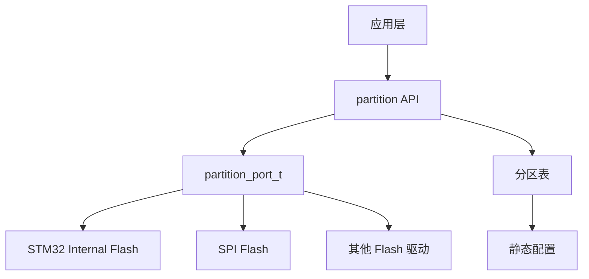
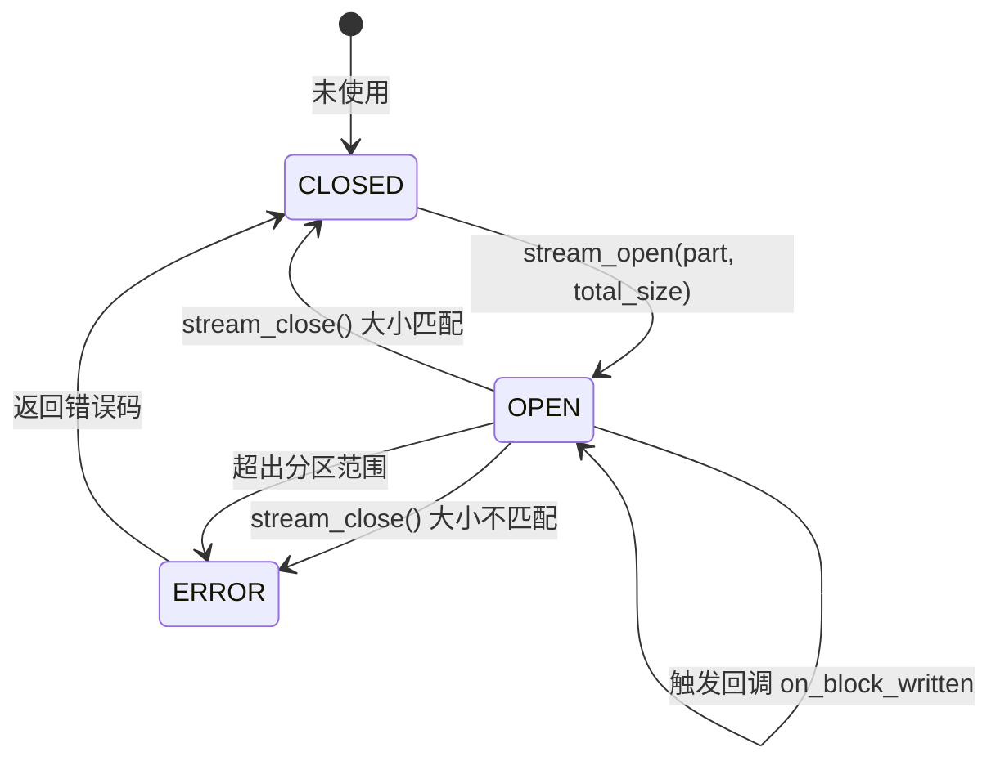
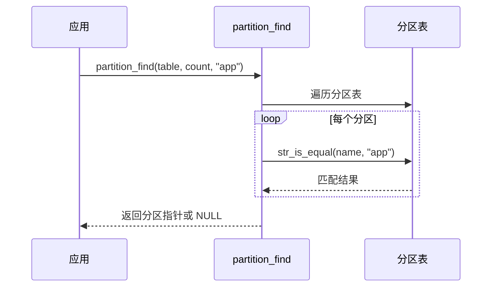
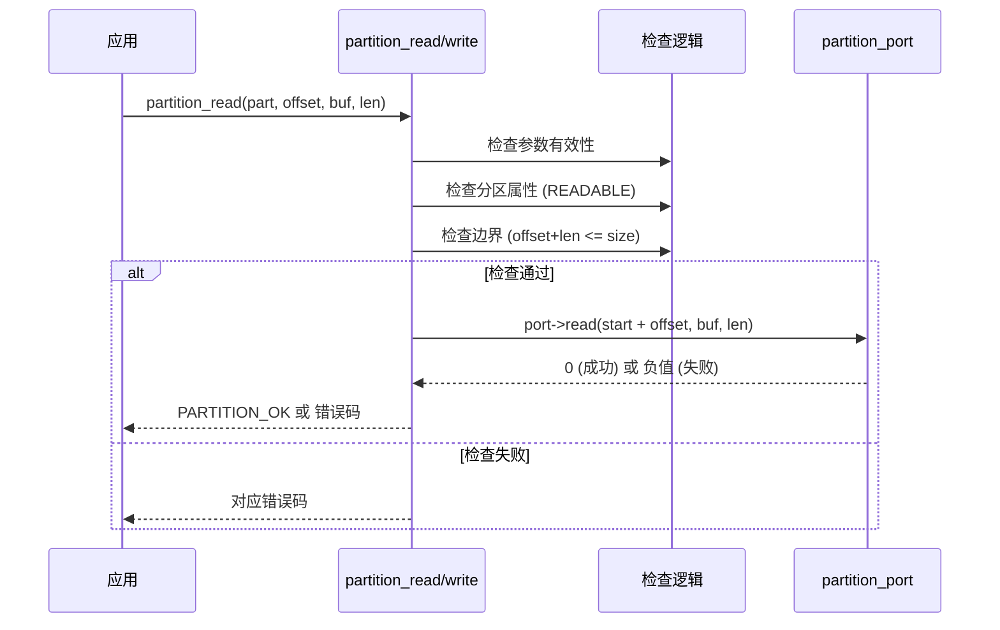
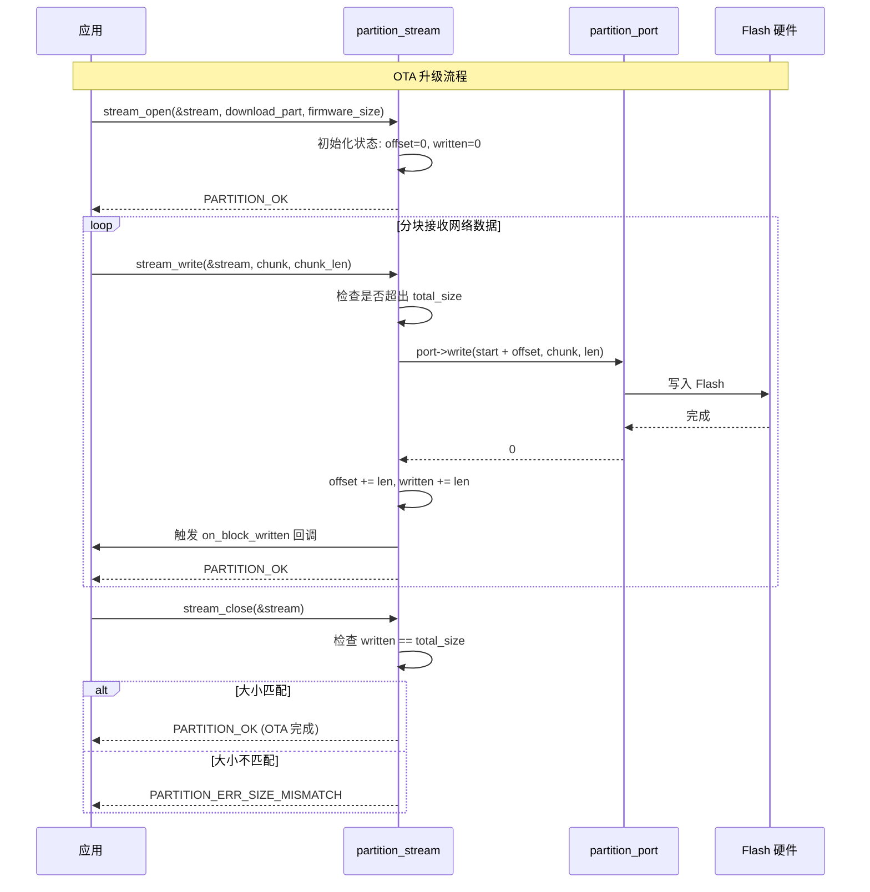

## 为什么要有 em_ota？

em_ota 模块旨在为嵌入式系统提供一套轻量级、无动态内存分配的 Flash 分区管理方案。其核心价值在于：

1. **抽象硬件差异**：通过 Port 层屏蔽不同 Flash 控制器的操作差异
2. **统一分区管理**：用静态分区表定义 Flash 布局，支持按名称查找分区
3. **OTA 友好**：提供流式写入接口，适配网络分块接收场景
4. **零动态分配**：所有结构体由用户静态分配，适合裸机和 RTOS 环境

---

## 设计目标

| 目标 | 说明 |
|------|------|
| 无动态内存 | 所有配置和状态由用户静态分配 |
| 分层解耦 | 上层分区逻辑与底层 Flash 操作分离 |
| 安全检查 | 自动校验分区属性和边界 |
| 流式支持 | 支持分块写入、进度跟踪、回调通知 |

---

## 架构设计

### 分层架构

```
┌─────────────────────────────────────────────────────────────┐
│                      应用层                                  │
│            (OTA升级、参数存储、固件管理)                      │
├─────────────────────────────────────────────────────────────┤
│                     partition API                            │
│    ┌─────────────┬─────────────┬─────────────────────────┐  │
│    │ 分区查找     │ 基础操作     │ 流式写入                │  │
│    │ find()      │ read/write  │ stream_open/write/close │  │
│    └─────────────┴─────────────┴─────────────────────────┘  │
├─────────────────────────────────────────────────────────────┤
│                    partition_port_t                          │
│              read() / write() / erase()                      │
├─────────────────────────────────────────────────────────────┤
│                   底层 Flash 驱动                             │
│              (HAL / 厂商驱动 / 模拟实现)                       │
└─────────────────────────────────────────────────────────────┘
```

### 模块关系



---

## 核心设计

### 1. 分区表（Partition Table）

分区表是用户定义的静态数组，描述整个 Flash 的逻辑布局。

**设计考量：**
- **静态定义**：编译期确定，无运行时开销
- **名称索引**：字符串名称便于代码可读性和灵活性
- **属性标志**：位域组合，支持多种属性

```c
typedef struct partition {
    const char *name;   // 分区名称
    u32 start;          // 起始地址（绝对地址）
    u32 size;           // 大小（字节）
    u8 flags;           // 属性标志
} partition_t;
```

**典型分区布局示例：**

```
Flash 地址空间 (STM32 示例)
┌─────────────────────────────────────────────────┐ 0x08000000
│ bootloader  (64KB)   [只读]                     │
├─────────────────────────────────────────────────┤ 0x08010000
│ app         (256KB)  [可读/可写/可擦除]         │
├─────────────────────────────────────────────────┤ 0x08050000
│ download    (128KB)  [可读/可写/可擦除] OTA暂存  │
├─────────────────────────────────────────────────┤ 0x08070000
│ params      (64KB)   [可读/可写/可擦除] 参数存储 │
└─────────────────────────────────────────────────┘ 0x08080000
```

### 2. Port 抽象层

Port 层是分区管理器与底层 Flash 驱动的桥梁，遵循依赖注入原则。

**设计优势：**
- 硬件无关：上层逻辑不依赖具体 Flash 类型
- 可测试性：单元测试时可注入模拟实现
- 灵活切换：同一套代码适配不同硬件平台

```c
typedef struct partition_port {
    i32 (*read)(u32 addr, u8 *buf, u32 len);
    i32 (*write)(u32 addr, const u8 *data, u32 len);
    i32 (*erase)(u32 addr, u32 len);
} partition_port_t;
```

**地址转换约定：**
- Port 函数接收的是**绝对地址**（由分区起始地址 + 偏移量计算）
- 分区管理器内部处理地址计算，Port 实现无需关心分区概念

### 3. 流式写入（Stream Write）

流式写入专为 OTA 升级设计，解决以下问题：

**问题场景：**
- 固件通过网络分块下载，不能一次性写入
- 需要跟踪写入进度
- 写入完成后需要校验完整性

**状态机设计：**



**流状态结构：**

```c
typedef struct partition_stream {
    const partition_t *part;            // 目标分区
    u32 current_offset;                 // 当前偏移
    u32 total_size;                     // 预期总大小
    u32 written;                        // 已写入字节数
    partition_stream_callback_t on_block_written;  // 回调
    void *userdata;                     // 用户数据
} partition_stream_t;
```

**回调机制设计：**

回调在每次成功写入后触发，典型用途：
- 更新 OTA 进度条
- 增量计算 CRC/校验和
- 记录写入日志

---

## 关键流程

### 分区查找流程



### 基础读写流程



### 流式写入流程（OTA 场景）



---

## 安全设计

### 边界检查

每次读写操作都会执行三重检查：

```
1. 参数检查    → NULL 指针、零长度
2. 属性检查    → 分区是否支持该操作
3. 边界检查    → offset + len ≤ size
```

### 错误恢复

| 错误类型 | 返回值 | 处理建议 |
|----------|--------|----------|
| 分区不存在 | `ERR_NOT_FOUND` | 检查分区表定义 |
| 超出范围 | `ERR_OUT_OF_RANGE` | 检查偏移和长度 |
| 只读分区 | `ERR_READONLY` | 检查分区属性标志 |
| 写入失败 | `ERR_WRITE_FAIL` | 检查 Flash 是否擦除、是否解锁 |
| 大小不匹配 | `ERR_SIZE_MISMATCH` | 检查网络传输是否完整 |

---

## 扩展点

### 1. 扇区对齐擦除

当前设计中 `partition_erase_range()` 直接传递长度给 Port。如需扇区对齐：

- 可在 Port 层实现对齐处理
- 或在上层调用前自行对齐

### 2. 磨损均衡

分区管理器不处理磨损均衡，但可通过以下方式扩展：

- Port 层实现磨损均衡映射
- 或使用专门的 FTL（Flash Translation Layer）

### 3. 写入校验

可在回调函数中实现增量校验：

```c
void verify_callback(u32 offset, const u8 *data, u32 len, void *userdata)
{
    crc_ctx_t *crc = (crc_ctx_t*)userdata;
    crc_update(crc, data, len);  // 增量计算 CRC
}
```

---

## 设计决策

| 决策 | 原因 |
|------|------|
| 静态分区表 | 无动态内存，编译期确定布局 |
| 绝对地址 | 简化 Port 实现，无需维护基地址 |
| 流式接口 | 适配 OTA 分块接收，支持进度跟踪 |
| 单例 Port | 系统通常只有一种 Flash 类型，简化接口 |
| 无锁设计 | 由用户决定是否需要线程保护 |

---

## 未来扩展

- [ ] 分区表 CRC 校验（防止损坏）
- [ ] 多 Flash 控制器支持
- [ ] 写入后自动读回校验
- [ ] 压缩存储支持
