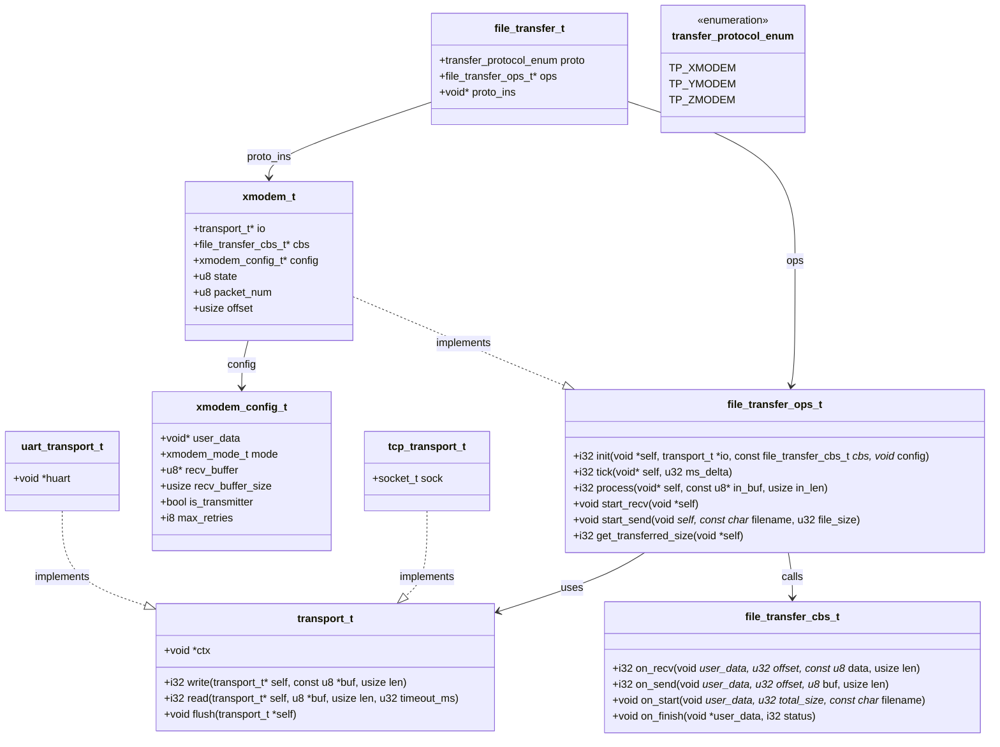
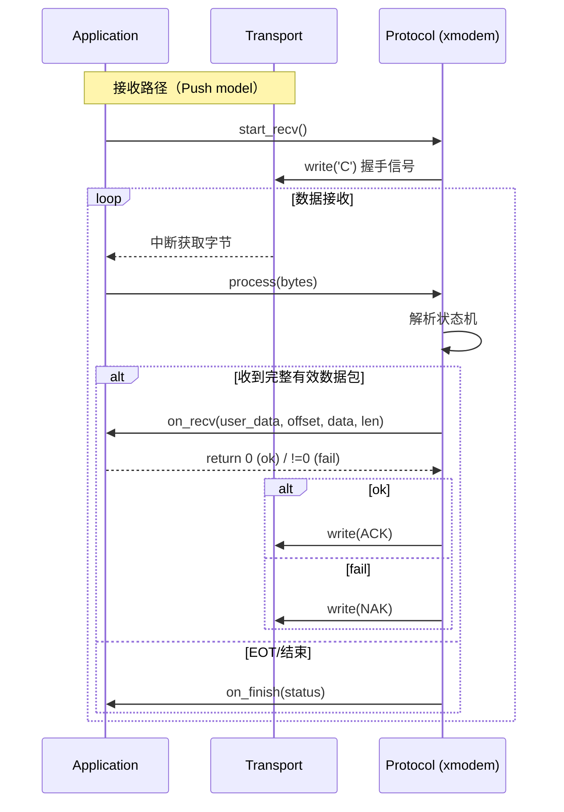
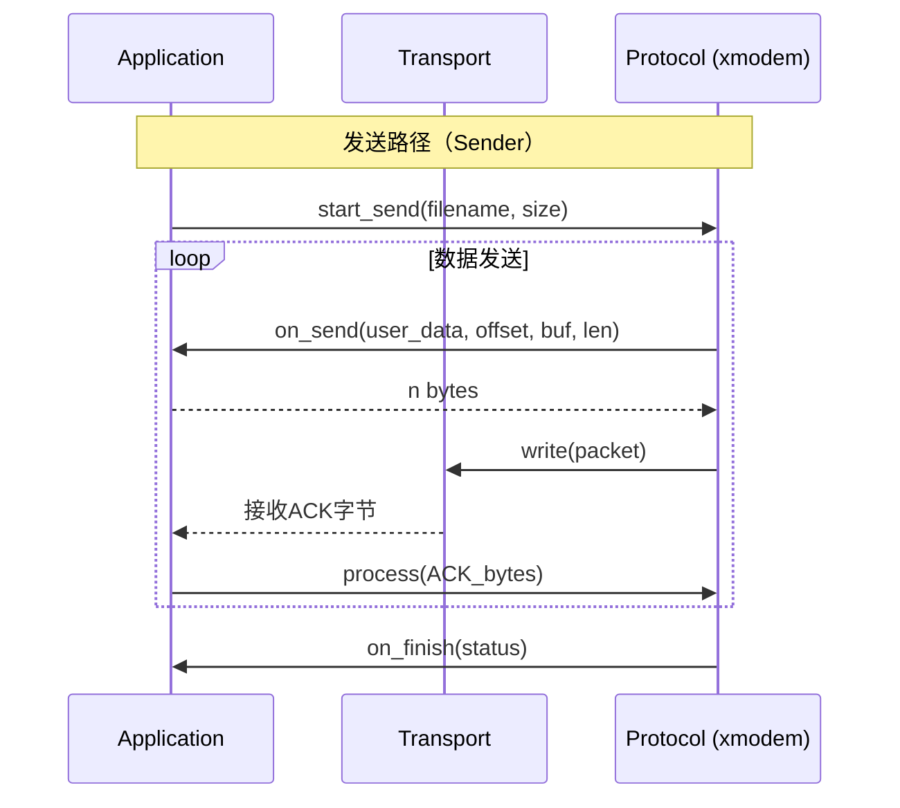

## em_protocol 设计文档

本模块实现了标准的 XMODEM/YMODEM 协议，支持接收端和发送端模式。设计上充分考虑了嵌入式环境的限制，具有低内存占用、无动态分配和高可靠性的特点。

## 设计特性

1. **无动态内存分配**：所有缓冲区均在 `xmodem_t` 结构体中静态分配或由用户提供，避免了内存碎片。
2. **Push 模型**：采用 Push 模型，由上层应用将接收到的数据推送给协议层，适合 MCU 中断驱动场景。
3. **双模支持**：通过简单的配置即可切换发送或接收模式。
4. **鲁棒性**：内置超时重传、错误计数、CRC/Checksum 自动协商以及取消传输（CAN）处理。
5. **流式处理**：支持边接收边处理数据，无需等待整个文件接收完成。

---

## 架构设计

### 类图



### 时序图

#### 接收者路径



#### 发送者路径



---

## 快速上手示例

### 1. 接收端示例 (MCU 固件升级场景)

模拟一个典型的 MCU 环境：串口中断接收数据，主循环处理协议，解析后的数据写入 Flash。

```c
#include <em_protocol/xmodem.h>
#include <em_protocol/file_transfer.h>
#include <em_protocol/transport.h>

// 全局对象
static xmodem_t        g_xm;
static xmodem_config_t g_config;
static transport_t     g_transport;
static u8              g_recv_buf[1024];

// 用户数据上下文
typedef struct {
    u32 flash_base;
} user_ctx_t;
static user_ctx_t g_user_ctx = { .flash_base = 0x08010000 };

// --- Transport 实现 ---
static i32 uart_write(transport_t* self, const u8* buf, usize len) {
    // HAL_UART_Transmit(&huart1, (uint8_t*)buf, len, 100);
    return (i32)len;
}

static i32 uart_read(transport_t* self, u8* buf, usize len, u32 timeout_ms) {
    // Push 模式下不使用
    return 0;
}

static void uart_flush(transport_t* self) {
    // 可选实现
}

// --- 协议回调 ---
static i32 on_recv(void* user_data, u32 offset, const u8* data, usize len) {
    user_ctx_t* ctx = (user_ctx_t*)user_data;
    // W25QXX_Write((u8*)data, ctx->flash_base + offset, len);
    return 0; // 返回 0 表示成功
}

static i32 on_send(void* user_data, u32 offset, u8* buf, usize len) {
    // 接收模式下不需要实现
    return 0;
}

static void on_start(void* user_data, u32 total_size, const char* filename) {
    // 传输开始，可用于初始化
}

static void on_finish(void* user_data, i32 status) {
    // 传输结束，可用于通知应用层
}

static const file_transfer_cbs_t g_cbs = {
    .on_recv   = on_recv,
    .on_send   = on_send,
    .on_start  = on_start,
    .on_finish = on_finish,
};

int main(void) {
    // 1. 初始化 Transport
    g_transport.write = uart_write;
    g_transport.read  = uart_read;
    g_transport.flush = uart_flush;
    g_transport.ctx   = NULL;

    // 2. 配置 XMODEM
    g_config.user_data        = &g_user_ctx;
    g_config.mode             = XMODEM_MODE_CRC;
    g_config.recv_buffer      = g_recv_buf;
    g_config.recv_buffer_size = sizeof(g_recv_buf);
    g_config.is_transmitter   = false;
    g_config.max_retries      = 10;

    // 3. 初始化 XMODEM
    xmodem_init(&g_xm, &g_transport, &g_cbs, &g_config);

    // 4. 启动接收
    xmodem_start_recv(&g_xm);

    while (1) {
        __WFI(); // 等待中断
    }
}

// 10ms 定时器中断
void Timer1_10ms_IRQHandler(void) {
    xmodem_tick(&g_xm, 10);
}

// 串口接收中断
void USART1_IRQHandler(void) {
    if (UART_GET_FLAG(UART_FLAG_RXNE)) {
        u8 data = UART_RECEIVE_DATA();
        xmodem_process(&g_xm, &data, 1);
    }
}
```

### 2. 发送端示例 (上位机/主控发送场景)

模拟从文件系统读取数据并发送给从机。

```c
#include <em_protocol/xmodem.h>
#include <em_protocol/file_transfer.h>
#include <em_protocol/transport.h>

static xmodem_t        g_xm;
static xmodem_config_t g_config;
static transport_t     g_transport;
static u8              g_recv_buf[1024];
static FILE*           g_file;

// --- Transport 实现 ---
static i32 serial_write(transport_t* self, const u8* buf, usize len) {
    return (i32)write(serial_fd, buf, len);
}

static i32 serial_read(transport_t* self, u8* buf, usize len, u32 timeout_ms) {
    // Push 模式下不主动调用，但 ACK 通过 process 接收
    return 0;
}

// --- 协议回调 ---
static i32 on_send(void* user_data, u32 offset, u8* buf, usize len) {
    fseek(g_file, offset, SEEK_SET);
    return (i32)fread(buf, 1, len, g_file);
}

static i32 on_recv(void* user_data, u32 offset, const u8* data, usize len) {
    return 0; // 发送模式下不使用
}

static void on_finish(void* user_data, i32 status) {
    printf("Transfer %s\n", status == 0 ? "success" : "failed");
}

static const file_transfer_cbs_t g_cbs = {
    .on_recv   = on_recv,
    .on_send   = on_send,
    .on_start  = NULL,
    .on_finish = on_finish,
};

void send_file_xmodem(const char* path) {
    g_file = fopen(path, "rb");
    fseek(g_file, 0, SEEK_END);
    u32 file_size = (u32)ftell(g_file);
    fseek(g_file, 0, SEEK_SET);

    // 配置发送模式
    g_config.user_data        = NULL;
    g_config.mode             = XMODEM_MODE_1K;
    g_config.recv_buffer      = g_recv_buf;
    g_config.recv_buffer_size = sizeof(g_recv_buf);
    g_config.is_transmitter   = true;
    g_config.max_retries      = 10;

    xmodem_init(&g_xm, &g_transport, &g_cbs, &g_config);
    xmodem_start_send(&g_xm, NULL, file_size);

    // 主循环
    while (g_xm.state != 0xFF) { // STATE_FINISHED
        u8 rx_byte;
        if (serial_read_byte(&rx_byte)) {
            xmodem_process(&g_xm, &rx_byte, 1);
        }
        xmodem_tick(&g_xm, 1);
        usleep(1000);
    }

    fclose(g_file);
}
```

---

## 核心设计

### 1. 零内存分配 (Zero Malloc)

协议栈内部使用静态缓冲区，所有缓冲区由用户通过 `xmodem_config_t` 提供，完全不依赖 `malloc/free`，适用于内存受限的嵌入式系统。

### 2. 统一传输接口 (`file_transfer_ops_t`)

通过 `file_transfer_ops_t` 抽象了 `init`, `tick`, `process`, `start_recv`, `start_send` 等核心动作。这使得应用层代码可以轻松在 XMODEM, YMODEM 等协议间切换，而无需修改主逻辑。

### 3. Push 模型

采用 Push 模型，由上层应用将接收到的数据推送给协议层，而不是协议层主动读取。这种设计：

- 适合中断驱动的 MCU 场景
- 减少缓冲区需求
- 天然实现流控（协议层未处理完时不会发 ACK，发送端自动等待）

---

## 错误处理

协议通过返回值和回调通知错误：

| 错误码 | 含义 | 说明 |
| :--- | :--- | :--- |
| `XMODEM_OK` | 成功 | 操作正常完成 |
| `XMODEM_ERR_RB_TOO_SMALL` | 缓冲区过小 | 用户提供的缓冲区无法容纳一个完整包 |
| `XMODEM_ERR_TIMEOUT` | 等待超时 | 对方长时间未响应 |
| `XMODEM_ERR_RETRY_EXCEED` | 重试超限 | 连续校验失败或超时次数达到上限 |
| `XMODEM_ERR_CANCELLED` | 传输取消 | 对方发送了 CAN 信号 |

传输结束时，`on_finish` 回调会被调用，`status` 参数指示最终状态。

---

## 状态机说明

模块内部维护了一个状态机，主要状态包括：

- `STATE_IDLE`: 空闲状态
- `STATE_WAIT_START`: 等待/发送启动信号
- `STATE_WAIT_PACKET`: (Rx) 等待数据包
- `STATE_TX_SEND_PACKET`: (Tx) 发送数据包
- `STATE_TX_WAIT_ACK`: (Tx) 等待确认
- `STATE_FINISHED`: 传输成功完成
- `STATE_ERROR`: 发生不可恢复错误